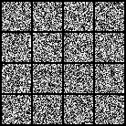
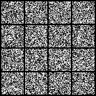
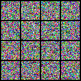

# Minimal Implementation of Scalable Rectified Flow Transformers

<p align="center">
  
  
</p>

> Left is the naive RF, right is the logit-normal time-sampling RF. Both are trained on MNIST.


This repository contains a minimal implementation of the rectified flow models. I've taken [SD3](https://arxiv.org/abs/2403.03206) approach of training along with [LLaMA-DiT](https://github.com/Alpha-VLLM/LLaMA2-Accessory) architecture. [Unlike my previous repo](https://github.com/cloneofsimo/minDiffusion) this time I've decided to split the file into 2: The model implementation and actual code, but you don't have to look at the model code.

Everything is still self-contained, minimal, and hopefully easy to hack. There is nothing complicated goin on if you understood the math.

# 1. *Simple* Rectified Flow, for beginners

Install torch, pil, torchvision

```
pip install torch torchvision pillow
```

Run

```bash
python rf.py
```

to train the model on MNIST from scratch.

If you are cool and want to train CIFAR instead, you can do that.

```bash
python rf.py --cifar
```

On 63'th epoch, your output should be something like:

<p align="center">
  
  
</p>


# 2. *Massive* Rectified Flow, muP Support

<p align="center">
  
</p>

This is for gigachads who wants to train Imagenet instead. Don't worry! IMO Imagenet is the new MNIST, and we will use my [imagenet.int8](https://huggingface.co/datasets/cloneofsimo/imagenet.int8) dataset for this.

First go to advanced dir, download the dataset.

```bash
cd advanced
pip install hf_transfer # just do install this.
bash download.sh
```

This shouldn't take more than 5 min if your network is decent.

Run

```bash
bash run.sh
```

to train the model. This will train Imagenet from scratch, do a muP grid search to find the aligned basin for the loss function, you unlock the zero-shot LR transfer for Rectified Flow models!


<p align="center">
  
</p>

This uses multiple techniques and codebases I have developed over the year. Its a natural mixture of [min-max-IN-dit](https://github.com/cloneofsimo/min-max-in-dit), [min-max-gpt](https://github.com/cloneofsimo/min-max-gpt), [ez-muP](https://github.com/cloneofsimo/ezmup)

# Citations

If you use this material, please cite this repository with the following:

```bibtex
@misc{ryu2024minrf,
  author       = {Simo Ryu},
  title        = {minRF: Minimal Implementation of Scalable Rectified Flow Transformers},
  year         = 2024,
  publisher    = {Github},
  url          = {https://github.com/cloneofsimo/minRF},
}
```